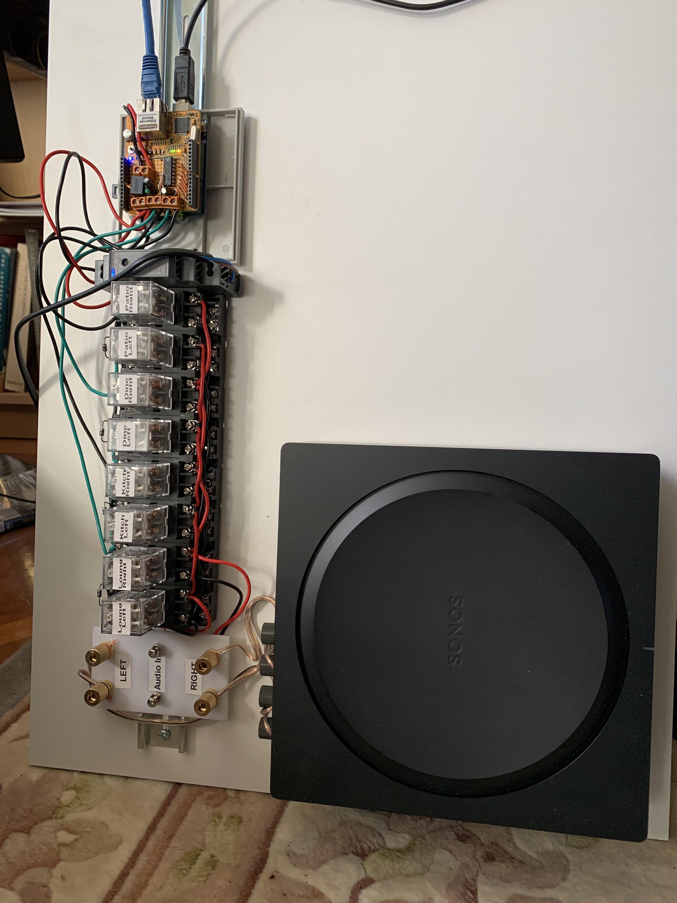

# speaker-switch
Voice activated IOT speaker selection switch

My Sonos amplifier is configured to drive speakers located in four zones around our living area. The relays
are controlled by a network-connected Arduino. In its initial version speakers can be selected using Siri 
voice commands.

